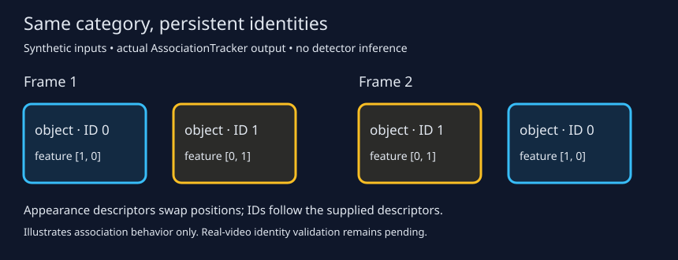

# OwlGraph — fast open-vocabulary scene graphs

Research project in progress: reuse a frozen OWLv2 detector's visual features
for efficient object detection, directed relationship prediction, and instance
association. Implemented in Python/PyTorch with ONNX, TensorRT, and CUDA graphs.

The detector and per-frame relationship head have been evaluated on Action
Genome and VG150. Tracking has implementation and integration tests; real-video
identity validation is still pending. Temporal attention/Mamba, JEPA training,
persistent relationship memory, and graph-based question answering are future
work, not current capabilities.

| Component | Implemented behavior |
| --- | --- |
| Detector | GPU preprocessing, FP16 TensorRT inference, selective token merging, previous-frame box protection, NMS, aligned visual descriptors |
| Relationship head | Directed subject/object projections, pair routing, text or closed predicate classifiers, text object labels, CUDA-graph replay |
| Tracking | Timestamp-aware association, supplied-feature BoT-SORT adapter, optional contrastive identity head, cache-based evaluation |
| Evaluation | Detection mAP, PredCls/SGDet, held-out classes and predicates, query retrieval, reference checks and latency experiments |

## Measured results

These are recorded experiments, not performance guarantees for a new machine.
Detailed protocols, controls, and limitations are in [RESULTS.md](RESULTS.md).

| Experiment | Result | Scope |
| --- | --- | --- |
| Protected merged detection | **0.1064 mAP**, versus 0.1079 unmerged (98.6% retained) | 68,183 Action Genome test frames; [§21](RESULTS.md#21-protecting-the-previous-frames-detections-during-merging) |
| Detector + relationship head | **4.90 ms/frame**; head adds 0.29 ms at 128 pairs | RTX 5090, GPU-resident frames, CUDA-graph replay; excludes decode and tracking; [§26](RESULTS.md#26-the-head-on-the-deployed-stream-accuracy-and-cost-rtx-5090) |
| Deployed relationship prediction | **R@50 0.351 / mR@50 0.279**, with constraint | 56,923 Action Genome test keyframes; [§26](RESULTS.md#26-the-head-on-the-deployed-stream-accuracy-and-cost-rtx-5090) |
| Held-out object classes | Predicate AP **0.328**, versus 0.333 when trained on those objects | Ground-truth boxes/labels; four held-out classes, single-seed comparison; [§29](RESULTS.md#29-open-vocabulary-objects-in-the-head-and-query-based-evaluation) |

Detection and exact category naming limit relationship recall: about 47% of
Action Genome ground-truth pairs are reachable with the current detections.
Unseen-predicate transfer remains weak, mainly spatial; broad open-vocabulary
action recognition is not established. VG150 mean recall is below SG-ViT's
published results, with different training setups. AG annotations are sparse,
and its recall evaluator still needs a line-by-line check against published AG
code before external comparisons. See [the open items](RESULTS.md#31-open-items).

## Reproducible visual example (CPU)

The example runs the actual association tracker on two synthetic objects with
the same category. Their appearance descriptors swap positions, and their IDs
follow those descriptors. It needs no model weights, dataset, or GPU. This is an
interface demonstration, not a real-video accuracy result.



For the smallest standalone environment, from the repository root:

```bash
PYTHONPATH=src uv run --no-project --isolated --python 3.13 \
  --with numpy --with scipy python examples/tracking_demo.py
```

Alternatively, use the full project environment described below:

```bash
uv run python examples/tracking_demo.py
```

Output: `artifacts/demo/tracking.svg` and a JSON record beside it. Expected IDs
are `[0, 1]` in the first frame and `[1, 0]` in the second. The committed preview
can be regenerated with `--output docs/tracking_demo.svg`.

## Full environment and tests

Use Python **3.13** and `uv`. The full dependency set includes NVIDIA inference
and quantization tools; GPU workflows require a compatible NVIDIA driver.
TensorRT engines are specific to the GPU/software environment and must be
rebuilt there. Model weights, datasets, trained heads, and generated engines
are not distributed in this repository.

```bash
uv sync --extra tracking
OMP_NUM_THREADS=1 MKL_NUM_THREADS=1 uv run python -m unittest discover -s tests -p 'test_*.py' -v
```

Local verification on 2026-10-02: **66 passed, 2 skipped** (CUDA runtime tests).
BoT-SORT integration tests use the real installed implementation. Synthetic
tracking tests establish implementation behavior, not real-video quality.

## GPU workflow

Build the baseline and feature-exporting engines; this downloads the pretrained
OWLv2 checkpoint and also builds comparison engines:

```bash
uv run python scripts/build_engines.py --features
uv run python scripts/speed_benchmark.py --help
uv run python scripts/verify_bridge.py --help
```

`StreamingDetector` returns boxes, scores, labels, and matching per-object
features on both CPU and GPU. It seeds a stream with an unmerged pass, then uses
previous-frame objectness and boxes to plan merging. Reset between videos.

The relationship runtime additionally needs a trained head checkpoint at
`artifacts/sgdet/rel_text_none.pt`. It is **not included**. Training and cache
entry points expose their dataset and artifact options through `--help`:

```bash
uv run python scripts/cache_sgdet.py --help
uv run python scripts/train_relationships.py --help
# After building engines, training the head, and supplying your video:
uv run python scripts/relationship_stream.py --latency --video /path/to/video.mp4
```

For tracking interfaces, cache requirements, identity-label provenance, and
BoT-SORT cadence constraints, see [docs/tracking.md](docs/tracking.md).

The original detector CLI remains available:

```bash
uv run sgg --help
uv run sgg validate-ag --ag-root /path/to/ag --split test
uv run sgg export --variant base_fp16
uv run sgg prepare --variant base_fp16
uv run sgg build --variant base_fp16
uv run sgg evaluate --variant base_fp16 --ag-root /path/to/ag
```

Action Genome requires annotations and extracted frames; see the
[cloud setup guide](docs/cloud_setup.md) for data preparation. Obtain
upstream datasets separately under their terms. INT8/FP8 paths are experimental;
`large_int8` is not a completed accuracy/performance comparison.

## Repository map

| Path | Purpose |
| --- | --- |
| `src/sggpipeline/detect/` | OWLv2, preprocessing, export, merging, TensorRT, streaming |
| `src/sggpipeline/relations/` | Heads, predicate embeddings, runtime, SGDet/VG evaluation |
| `src/sggpipeline/tracking/` | Association, BoT-SORT, identity training, caches |
| `src/sggpipeline/ag/`, `vg/` | Dataset readers and vocabularies |
| `scripts/` | Training, experiments, diagnostics, and benchmarks |
| `tests/` | Unit tests and integration checks |
| `examples/` | Reproducible synthetic visual demonstration |

[RESULTS.md](RESULTS.md) is the experiment record; [plan.md](plan.md) describes
the broader research proposal. [docs/history/HANDOFF.md](docs/history/HANDOFF.md) is a historical
hand-off note that predates the relationship work. [Resume wording](docs/RESUME.md) summarizes
implemented contributions with the measurement scope preserved.

## License

The code is released under the [MIT License](LICENSE). Datasets and model
weights are not included and keep their own terms: Action Genome and Charades
are for non-commercial research use, VG150 derives from Visual Genome (CC BY
4.0), and OWLv2 and the text encoders follow their publishers' licenses.
